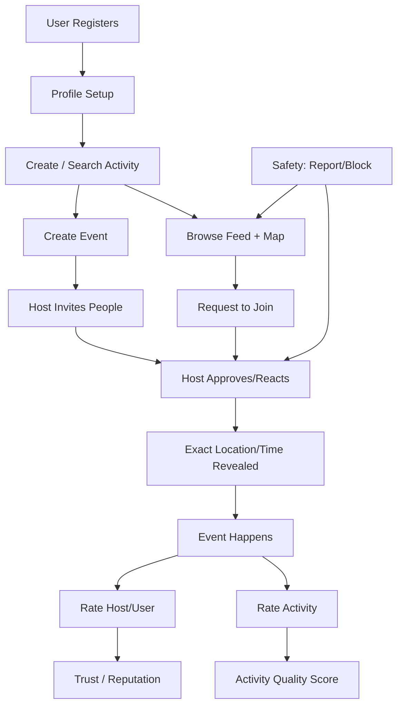

# Gathr Architecture (Current + Target)

## 1) High-level Flow

## 2) Current Tables
- `events`
  - id, title, category, area, exact_location, exact_time, host_name, created_at
- `join_requests`
  - id, event_id, requester_name, status, created_at
- `event_ratings`
  - event_id, rater_name, rated_name, metrics..., comment
- `user_reports`
  - reporter_name, reported_name, reason
- `user_blocks`
  - blocker_name, blocked_name

## 3) Current Enforcement
- Location/time reveal only after approval (UI logic)
- Ratings only for approved host↔attendee event pairs (RLS policy)
- Ratings only after event end time (RLS policy + frontend check)
- Blocked hosts hidden in feed (UI logic)

## 4) Target Data Model Additions

### `profiles`
- id (uuid), full_name, about_me, photo_url
- gender, age_group
- email, email_verified
- phone, phone_verified
- postcode, lat, lng

### `activities_catalog`
- id, name, category
- is_online boolean
- game_key nullable

### `event_invites`
- id, event_id, inviter_user_id, invitee_user_id
- status (pending/accepted/rejected/approved)

### `event_activity_ratings`
- id, event_id, rater_user_id
- activity_score (1-5), comment

### `games` + `game_rankings` (optional split)
- games(id, key, display_name)
- game_rankings(id, user_id, game_id, score, tier)

### events extensions
- required_people int
- approx_lat / approx_lng (for map area discovery)
- exact_lat / exact_lng (precise revealed pin)
- is_online bool

## 5) API / Query Surface (Supabase)
- Feed query with filters: text, category, location, radius, time-range
- Activity autocomplete endpoint/query
- Invite management endpoints
- Ranking leaderboard queries by `game_key`

## 6) Frontend Modules (Recommended)
- `screens/Auth/*`
- `screens/Profile/*`
- `screens/EventCreate/*`
- `screens/Feed/*`
- `screens/Map/*`
- `screens/Moderation/*`
- `services/supabase/*`
- `components/filters/*`
