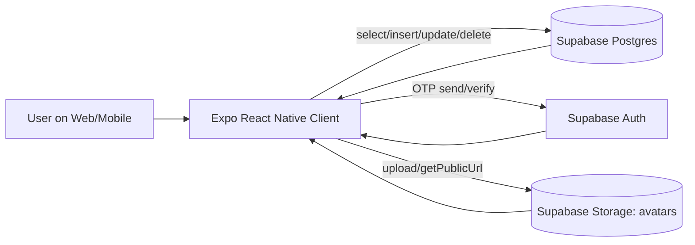
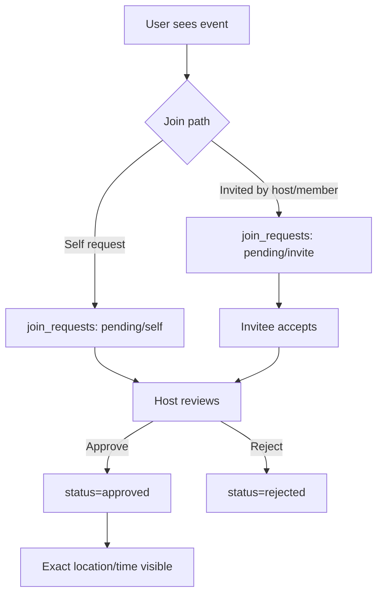
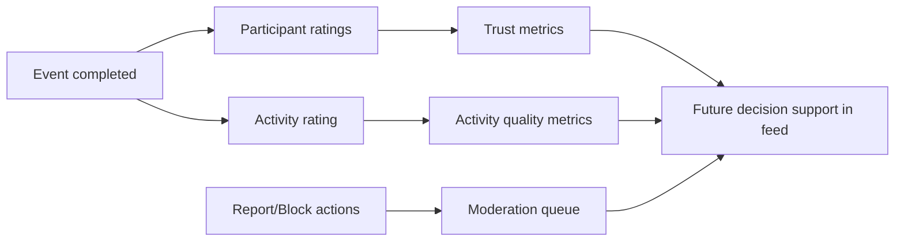

# Gathr Architecture (Frontend + Backend)

_Last updated: 2026-02-27_

## 1) System Overview

Gathr is currently a **single-client React Native app (Expo)** backed by **Supabase** (Postgres + Auth + Storage).

- **Frontend:** `App.tsx` + reusable components (`MapCanvas`, `EventMapBrowse`)
- **Backend:** Supabase tables, RLS/policies, Auth OTP flows, Storage bucket for avatars
- **Data flow:** UI actions → Supabase queries/mutations → local state refresh (`loadData`) → derived UI projections (`useMemo`)

---

## 2) Runtime Architecture

---

## 3) Frontend Architecture

## 3.1 State Organization (Current)

`App.tsx` holds major state buckets:

1. **Domain data state**
   - `events`, `requests`, `ratings`, `activityRatings`, `comments`
   - `reports`, `blocks`, `moderationStatuses`, `profiles`

2. **View/UI state**
   - section visibility toggles (`showFeedSection`, `showProfileSection`, ...)
   - modal visibility (`registrationModalVisible`, map/date modals)
   - picker/suggestion visibility

3. **Form state**
   - registration/profile fields
   - event creation fields
   - invite/rating/report forms

4. **Derived state (`useMemo`)**
   - filtered feed, suggestions, moderation queue, notifications
   - profile completion and registration checklist
   - map event projections and leaderboard views

## 3.2 Key frontend flows

### A) Onboarding / Registration
- Full-screen onboarding modal with step progress
- Supports testing fast-track + optional skip paths
- Email OTP verify flow + phone OTP verify flow UI
- Password strength + confirm validation
- Web draft persistence (localStorage) + restore on refresh
- Post-signup checklist modal for optional profile completion

### B) Event lifecycle
- Create event (category/activity/description/location/date-time/capacity)
- Feed listing with search + filters + map browse entry point
- Request/invite/approve flow with host gate
- Exact location/time hidden until approved

### C) Trust/safety lifecycle
- Multi-metric person ratings post-event
- Activity quality ratings
- Report + block controls
- Moderation dashboard (severity grouping + queue)

## 3.3 Frontend modules (target refactor)

Current implementation is monolithic in `App.tsx`; recommended modular split:

- `features/onboarding/*`
- `features/profile/*`
- `features/events/create/*`
- `features/events/feed/*`
- `features/events/map/*`
- `features/invites/*`
- `features/ratings/*`
- `features/moderation/*`
- `services/supabase/*` (queries/mutations)
- `domain/selectors/*` (memoized projections)

---

## 4) Backend Architecture (Supabase)

## 4.1 Data stores

1. **Postgres (primary domain state)**
2. **Auth (OTP/magic-link identity verification)**
3. **Storage (`avatars` bucket)**

## 4.2 Core tables (in use)

- `events`
  - event core: title, category, description, host, area/exact location, time
  - capacity + coords extensions already present (`min_people`, `max_people`, `no_max`, `exact_lat`, `exact_lng`)

- `join_requests`
  - request + invite state machine
  - includes source/response metadata for host/member/self invite pathways

- `event_ratings`
  - participant ratings with multi-metric trust dimensions

- `event_activity_ratings`
  - event/activity quality score + comment

- `event_comments`
  - per-event thread-like comments

- `event_rating_skips`
  - track deferred/skip rating actions

- `user_profiles`
  - registration/profile identity, contact, verification flags, interests, avatar

- `user_reports`, `user_blocks`
  - safety actions and visibility controls

- `user_moderation_status`
  - admin review status overlays for moderation workflow

## 4.3 Backend enforcement (current)

- RLS/policy-backed rating constraints:
  - only valid approved attendee↔host relationships
  - only after event end
- App-level checks:
  - host approval required to reveal exact details
  - capacity checks on approvals/invites
  - blocking filters now enforced bidirectionally in feed/invite/approval flows
- Trigger-level trust & safety controls:
  - report anti-spam limits (3 per 10 minutes per reporter; 1 per 24h per reporter→reported pair)
  - block requires prior detailed report for same actor→target pair (report-first policy)
  - block/unblock anti-thrash limits using moderation audit history
  - moderation action audit trail (`moderation_audit_log`) for report/block/status changes

## 4.4 Auth/verification architecture

- Email OTP via `supabase.auth.signInWithOtp({ email })` + `verifyOtp`
- Phone OTP via `supabase.auth.signInWithOtp({ phone })` + `verifyOtp`
- Production dependency: SMS provider configuration
- Template dependency: email templates must use `{{ .Token }}` for code-based UX

## 4.5 Storage architecture

- Avatars uploaded from client to `avatars` bucket
- Public URL resolved after upload and stored in `user_profiles.avatar_url`

---

## 5) Domain Flow Diagrams

## 5.1 Join/Invite approval gate

## 5.2 Trust/safety loop

---

## 6) Query Surface (Current + Target)

## 6.1 Current query style
- Bulk load pattern via `loadData()` using multiple `select` calls
- Client-side derivation for filters/suggestions/queues
- Upsert-heavy writes for idempotent profile/rating/skip interactions

## 6.2 Target query evolution
- Move to feature-level query functions (service layer)
- Introduce paginated feed querying
- Move heavy aggregations to SQL views/RPC where needed:
  - moderation queue scoring
  - leaderboards
  - reputation thresholds

---

## 7) Security/Policy Posture

Current posture:
- Dev-friendly RLS/policy patching is in place
- Some critical constraints are enforced in DB policies + mirrored in UI

Production hardening checklist:
- tighten RLS for all write paths by authenticated identity model
- remove assumptions based on display_name-only identity
- formalize admin role checks server-side
- audit OTP abuse/rate-limits and bot resistance

---

## 8) Known Technical Debt

1. `App.tsx` is too large (state + UI + data access mixed)
2. duplicated validation/business rules between onboarding and profile panel
3. broad client-side `loadData()` fan-out can become expensive at scale
4. moderation/reputation calculations mostly client-computed

---

## 9) Recommended Next Refactors

1. Extract onboarding into dedicated feature module
2. Create typed Supabase repository/service layer
3. Introduce domain selectors and shared validators
4. Add release-grade smoke/regression checklist
5. Add structured migration + seed documentation for contributors

---

## 10) Source of Truth Policy

- `ROADMAP.md` = product status and completion tracking
- `ARCHITECTURE.md` = technical system design (frontend/backend)
- On substantial feature updates:
  1. Update ROADMAP status
  2. Update architecture sections impacted
  3. Commit/push both docs with the feature PR when possible
